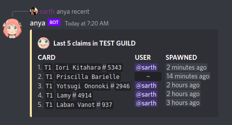
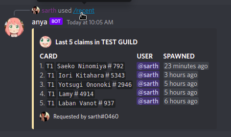
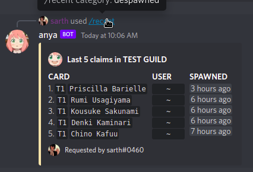
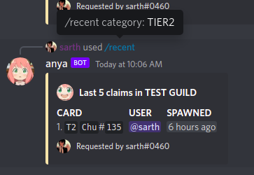
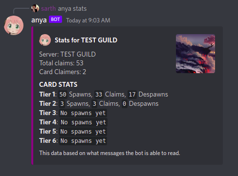

## SHOOB COMMANDS

The bot saves data for all the cards spawned in the server.

### RECENTLY SPAWNED CARDS

`anya recent|r`: The `recent` command can be used to view the last cards that spawned in the server with the following information.

| DATA | INFO |
|------|------|
|Name| Name of the card which spawned|
|Tier| Card's Tier (T1-T6)|
|Time| The time at which card spawned|
|Claimer*| The user who claimed the spawn|
|Version*| Version of the card claimed|

*: data available only if the card was claimed.

Additional Options:

`claimed|--c`: for only cards which have been claimed.

`despawned|--d`: despawned cards when noone claimed them.

`tier1|t1`: TIER1 card spawns.

`tier2|t2`: TIER2 card spawns.

`tier3|t3`: TIER3 card spawns.

`tier4|t4`: TIER4 card spawns.

`tier5|t5`: TIER5 card spawns.

`tier6|t6`: TIER6 card spawns.

****

****

### SERVER STATS

The `anya stats` command can be used to view server's stats.

It depends on the "Read Messages" permissions in the shoob bot channel.

|DATA|INFO|
|-----|-----|
|Name|Name of the respective Guild.|
|Claims|Total number of cards claimed.|
|Users|Claimers in the server.|
|Tiers Data|Spawned, Claimed and Despawned cards count.|

*** 
